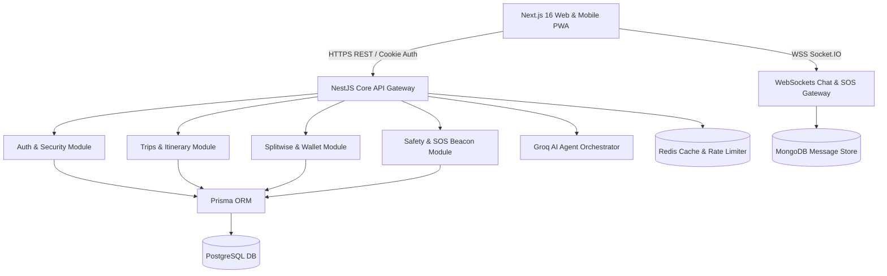

# 🏛️ YatraSecure System Architecture

YatraSecure is an intelligent, safety-first collaborative travel platform engineered to provide seamless group trip management, real-time safety monitoring, automated splitwise expense settlements, AI-driven destination itineraries, and social travel networking.

## Architectural Highlights
- **Backend**: NestJS v11 (TypeScript) structured into decoupled domain modules with Prisma ORM and Express platform.
- **Frontend**: Next.js 16 (App Router), React 19, TailwindCSS, Framer Motion, Leaflet maps, Recharts analytics.
- **Real-time Engine**: Socket.IO WebSockets for live group chat, typing indicators, and emergency SOS broadcasting.
- **AI Engine**: Groq LLaMA 3.3 integration for personalized destination guides, packing list generation, and personality matchmaking.
